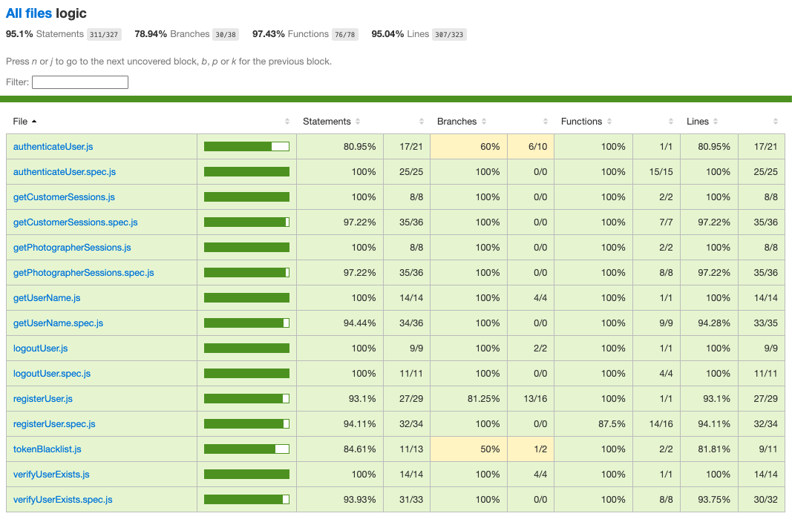

# sesiona - App

## Intro

Sesiona is designed to facilitate the efficient hiring of photographers, optimizing the management of professionals' availability and clients' accessibility. Through a dynamic allocation algorithm, the system automatically coordinates user requests, ensuring that the most suitable photographers are assigned based on availability and client preferences.

## Funcional

It features an intuitive interface that enables swift and frictionless bookings, while a real-time data management system ensures constant availability updates. Additionally, the system integrates communication protocols for efficient interaction between clients and photographers, enhancing the overall experience and reducing wait times.

The system's architecture is designed to scale flexibly, allowing for the seamless onboarding of new users and photographers while maintaining high levels of performance and efficiency.

### Use Cases

Customer (User)
- search sesion (set day, set hour, set geo,...)
- add session
- remove sesion
- checkout cart (create order)
- view order
- view orders history
- add profile (phone, email, geo,...)
- edit profile

Photographer (User)
- add service
- remove service
- add availability (Calendar)
- remove availability (Calendar)
- add profile (phone, email, geo,...)
- edit profile

Admin (User)
- add Customer
- remove customer
- add Photographer
- remove Photographer
- disable Calendar for Customer
- enable Calendar for Customer

### UXUI Design

[Figma](https://www.figma.com/proto/ec0DHZy7CKIwtIT6DcUVBP/Untitled?node-id=0-1&t=pNPWIXNj7gWhT5JO-1)

## Technical

### Blocks

- App
- API
- DB

### Packages

- app 
- api
- com
- doc (documentation)

### Techs
- HTML/CSS/JS
- React
- Node/Express
- ...

### Data Model

User
- id (ObjectId)
- name (string, required)
- email (string, required)
- phone (string, required)
- username (string, required, unique)
- password (string, required, select: false)
- role (string, required, enum: ['customer', 'photographer', 'administrator'])
- photographerId (ObjectId, ref: 'Photographer', optional)
- bio (string, default: '')
- portfolio (array of strings, default: [])

Service
- name (string, required)
- quantity (number, required)

Session
- date (Date, required)
- startDate (Date, required)
- endDate (Date, required)
- photographer (ObjectId, ref: 'Photographer', required)
- customer (ObjectId, ref: 'User', required)
- status (string, enum: ['scheduled', 'completed', 'cancelled'], default: 'scheduled')
- type (string, required)
- address (object)
  - type (string)
  - street (string)
  - postalCode (string)
  - city (string)
  - province (string)
- services (array of strings)

Customer
- user (ObjectId, ref: 'User', required)
- address (string, required, unique)
- services (array of Service)
- sessions (array of ObjectId, ref: 'Session')

Photographer
- user (ObjectId, ref: 'User', required)
- coverage_area (string, required)
- sessions (array of ObjectId, ref: 'Session')

Availability
- photographer (ObjectId, ref: 'Photographer', required)
- date (Date, required)
- startDate (Date, required)
- endDate (Date, required)
- available (boolean, default: true)
- timestamps (createdAt, updatedAt)

### Coverage

## Tasks

[GitHub](https://github.com/b00tc4mp/isdi-parttime-202410/issues/44)